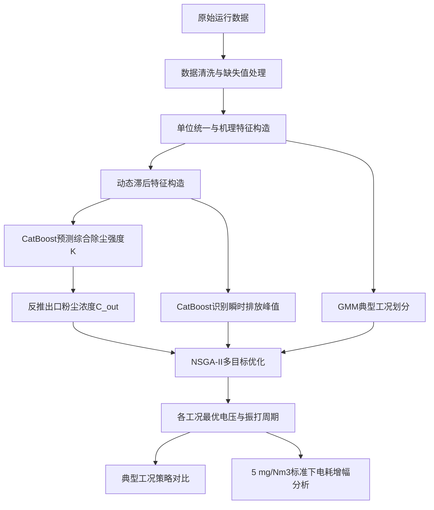

# ESP_Cement_Optimization_Project

> 水泥烧成系统电除尘器协同优化控制数学建模工程  
> A mathematical modeling project for collaborative optimization control of an Electrostatic Precipitator in a cement kiln system.

---

## 1. 项目简介

本项目面向 **水泥窑尾电除尘器协同优化控制问题**，基于某水泥企业 5000 吨/日新型干法生产线窑尾电除尘器连续 7 天运行数据，建立数据驱动与机理约束相结合的数学模型，实现：

1. 分析入口工况与操作参数对出口粉尘浓度的影响；
2. 识别振打周期对瞬时排放峰值的影响；
3. 划分典型工况；
4. 在排放达标约束下优化电压组合与振打周期组合；
5. 分析更严格排放标准下的电耗增幅。

本项目主要服务于数学建模竞赛论文建模、程序实现、结果分析与图表输出。

---

## 2. 赛题背景

水泥工业是高能耗、高排放行业。电除尘器是水泥窑尾烟气净化中的关键设备，其运行效果直接影响企业环保达标和能耗控制水平。

电除尘器通过高压电场使粉尘荷电，并在电场力作用下使粉尘迁移、沉积到极板上。随着粉尘积累，需要通过振打装置进行清灰。然而，振打过程可能导致短时间粉尘再悬浮，引起出口浓度瞬时峰值。

实际生产中，入口温度、入口浓度、烟气流量等工况参数不断波动；各电场二次电压和振打周期等操作参数也会直接影响除尘效率和电耗。因此，需要建立智能化、精细化的协同优化模型，在保证出口粉尘浓度达标的同时降低总电耗。

---

## 3. 数据说明

原始数据文件为：

```text
Cement_ESP_Data.csv
```

请将其放置于：

```text
00_data/raw/Cement_ESP_Data.csv
```

数据字段如下：

| 字段名 | 单位 | 含义 |
|---|---:|---|
| `timestamp` | — | 时间戳，分钟级 |
| `Temp_C` | ℃ | 烟气入口温度 |
| `C_in_gNm3` | g/Nm³ | 入口粉尘浓度 |
| `Q_Nm3h` | Nm³/h | 烟气流量 |
| `U1_kV` ~ `U4_kV` | kV | 四个电场二次电压 |
| `T1_s` ~ `T4_s` | s | 四个电场振打周期 |
| `C_out_mgNm3` | mg/Nm³ | 出口粉尘浓度 |
| `P_total_kW` | kW | 总除尘电耗 |

注意：

- 入口粉尘浓度单位为 `g/Nm³`；
- 出口粉尘浓度单位为 `mg/Nm³`；
- 建模时需要进行单位换算；
- 部分出口浓度数据可能存在缺失值，程序中会进行相应处理。

---

## 4. 问题定义

### 问题一：影响因素分析与瞬时峰值识别

分析入口条件：

\[
Temp,\ C_{in},\ Q
\]

以及操作参数：

\[
U_1,U_2,U_3,U_4,\ T_1,T_2,T_3,T_4
\]

与出口粉尘浓度：

\[
C_{out}
\]

之间的关系，并研究振打周期对瞬时排放峰值的影响。

---

### 问题二：工况划分与节能优化

考虑入口浓度和温度随时间波动，设计典型工况划分方法。

在满足：

\[
C_{out} \leq 10\ \text{mg/Nm}^3
\]

的前提下，针对不同工况确定最优电压组合：

\[
(U_1,U_2,U_3,U_4)
\]

和振打周期组合：

\[
(T_1,T_2,T_3,T_4)
\]

使总电耗最低。

---

### 问题三：典型工况策略对比

基于问题二得到的最优参数组合，选取两个差异明显的典型工况，例如：

- 高浓度工况；
- 低浓度工况；
- 高温工况；
- 高流量工况。

分别给出最优操作参数表，并分析不同工况下电压和振打周期优化优先级的变化规律。

---

### 问题四：更严格排放标准下的电耗增幅分析

假设出口粉尘浓度限值由：

\[
10\ \text{mg/Nm}^3
\]

下调为：

\[
5\ \text{mg/Nm}^3
\]

定量分析总电耗增加百分比，并给出高浓度工况下的应对建议。

---

## 5. 总体技术路线

本项目采用：

\[
\boxed{
\text{半机理除尘强度 }K
+
\text{动态特征增强}
+
\text{CatBoost预测}
+
\text{GMM工况划分}
+
\text{NSGA-II多目标优化}
}
\]

总体流程如下：



---

## 6. 核心建模方法

### 6.1 综合除尘强度指标

由于入口浓度单位为 `g/Nm³`，出口浓度单位为 `mg/Nm³`，二者相差 1000 倍，因此定义综合除尘强度：

\[
K=-\ln\left(\frac{C_{out}}{1000C_{in}}\right)
\]

其中：

- \(C_{in}\)：入口粉尘浓度，单位为 `g/Nm³`；
- \(C_{out}\)：出口粉尘浓度，单位为 `mg/Nm³`。

根据该定义：

\[
C_{out}=1000C_{in}e^{-K}
\]

因此本项目优先预测 \(K\)，再反推出 \(C_{out}\)，增强模型的物理解释性。

---

### 6.2 动态特征增强

为刻画电除尘器运行过程中的滞后性和短时波动，构造如下动态特征：

- 出口浓度滞后项：

\[
C_{out,t-1}, C_{out,t-3}, C_{out,t-5}, C_{out,t-10}, C_{out,t-15}, C_{out,t-30}
\]

- 综合除尘强度滞后项：

\[
K_{t-1}, K_{t-3}, K_{t-5}, K_{t-10}, K_{t-15}, K_{t-30}
\]

- 电压变化量：

\[
\Delta U_i=U_{i,t}-U_{i,t-1}
\]

- 振打周期变化量：

\[
\Delta T_i=T_{i,t}-T_{i,t-1}
\]

- 滚动统计特征：

\[
\mu_{30,t},\ \sigma_{30,t}
\]

用于描述过去 30 分钟出口浓度的平均水平和波动程度。

---

### 6.3 瞬时排放峰值定义

采用过去 30 分钟出口浓度的滚动均值和标准差识别瞬时排放峰值：

\[
Peak_t=
\begin{cases}
1, & C_{out,t}>\mu_{30,t}+2\sigma_{30,t} \\
0, & otherwise
\end{cases}
\]

其中：

- \(\mu_{30,t}\)：过去 30 分钟出口浓度均值；
- \(\sigma_{30,t}\)：过去 30 分钟出口浓度标准差。

随后建立 CatBoost 分类模型预测峰值风险：

\[
P(Peak_t=1)=h(X_t)
\]

---

### 6.4 典型工况划分

针对工况变量：

\[
Z_t=[Temp_t,\ C_{in,t},\ Q_t,\ C_{in,t}Q_t]
\]

采用 GMM 高斯混合模型进行工况划分：

\[
p(x)=\sum_{k=1}^{K}\pi_k\mathcal{N}(x|\mu_k,\Sigma_k)
\]

并使用 BIC 准则选择合适的工况类别数。

---

### 6.5 多目标优化模型

针对每一种典型工况，优化决策变量：

\[
x=[U_1,U_2,U_3,U_4,T_1,T_2,T_3,T_4]
\]

优化目标包括：

\[
\min \left[
\hat{P}_{total},
\hat{C}_{out},
\hat{R}_{peak}
\right]
\]

约束条件包括：

\[
\hat{C}_{out}\leq 10
\]

\[
U_i^{min}\leq U_i\leq U_i^{max}
\]

\[
T_i^{min}\leq T_i\leq T_i^{max}
\]

其中，振打周期上下界采用历史合理分位数约束，避免为了降低电耗而无限延长振打周期。

---

## 7. 工程目录结构

```text
ESP_Cement_Optimization_Project
│
├─ 00_data/
│   ├─ raw/
│   │   └─ Cement_ESP_Data.csv
│   ├─ processed/
│   └─ external/
│
├─ 01_config/
│   ├─ config_main.m
│   ├─ config_features.m
│   ├─ config_model.m
│   └─ config_optimization.m
│
├─ 02_src/
│   ├─ data_preprocess/
│   ├─ feature_engineering/
│   ├─ models/
│   ├─ condition_clustering/
│   ├─ optimization/
│   ├─ visualization/
│   └─ utils/
│
├─ 03_scripts/
│   ├─ run_all.m
│   ├─ run_problem1.m
│   ├─ run_problem2.m
│   ├─ run_problem3.m
│   ├─ run_problem4.m
│   └─ check_python_catboost.m
│
├─ 04_results/
│   ├─ problem1/
│   ├─ problem2/
│   ├─ problem3/
│   ├─ problem4/
│   └─ summary/
│
├─ 05_paper/
│   ├─ figures/
│   ├─ tables/
│   ├─ tex_or_doc/
│   ├─ references/
│   └─ writing_notes.md
│
├─ 06_docs/
│   ├─ problem_statement/
│   ├─ method_notes/
│   └─ experiment_record.md
│
└─ README.md
```

---

## 8. 环境依赖

### 8.1 MATLAB

建议版本：

```text
MATLAB R2021b 或更高版本
```

建议工具箱：

- Statistics and Machine Learning Toolbox
- Optimization Toolbox
- Global Optimization Toolbox

其中：

- `perfcurve` 用于分类模型 AUC 计算；
- `fitgmdist` 可用于 GMM 工况划分；
- `gamultiobj` 可用于 NSGA-II 多目标优化。

---

### 8.2 Python

由于 MATLAB 没有官方 CatBoost 工具箱，本项目采用：

```text
MATLAB 调用 Python CatBoost
```

建议 Python 版本：

```text
Python 3.8+
```

安装依赖：

```bash
pip install catboost numpy scikit-learn
```

如果使用 Anaconda：

```bash
conda activate your_env_name
pip install catboost numpy scikit-learn
```

---

## 9. 使用方法

### 9.1 克隆项目

```bash
git clone https://github.com/STZ5353/ESP_Cement_Optimization_Project.git
cd ESP_Cement_Optimization_Project
```

---

### 9.2 放置数据

将数据文件放入：

```text
00_data/raw/Cement_ESP_Data.csv
```

---

### 9.3 检查 Python 与 CatBoost

在 MATLAB 中运行：

```matlab
cd("项目所在路径/ESP_Cement_Optimization_Project")
run("03_scripts/check_python_catboost.m")
```

如果 MATLAB 没有识别到正确的 Python 环境，可以在：

```text
01_config/config_main.m
```

中手动指定：

```matlab
cfg.pythonExe = "D:\Anaconda\python.exe";
```

---

### 9.4 运行问题一

```matlab
run("03_scripts/run_problem1.m")
```

问题一将完成：

- 数据读取；
- 数据清洗；
- 综合除尘强度 \(K\) 计算；
- 动态特征构造；
- CatBoost 回归预测；
- 出口浓度反推；
- 峰值标签构造；
- CatBoost 峰值分类；
- 特征重要性输出；
- 振打周期分组峰值率统计；
- 图表保存。

---

### 9.5 运行全部问题

当所有模块完成后，可运行：

```matlab
run("03_scripts/run_all.m")
```

---

## 10. 当前完成进度

| 模块 | 状态 | 说明 |
|---|---|---|
| 工程目录结构 | 已完成 | 已按建模任务拆分为数据、配置、源码、脚本、结果、论文与文档区 |
| 问题一数据清洗 | 已完成 | 支持原始 CSV 读取、时间排序、基础异常过滤 |
| 问题一特征工程 | 已完成 | 包含机理特征、动态滞后特征、峰值标签 |
| CatBoost 回归模型 | 已完成 | 用于预测综合除尘强度 \(K\) |
| 出口浓度反推 | 已完成 | 由 \(\hat{K}\) 反推 \(\hat{C}_{out}\) |
| CatBoost 峰值分类模型 | 已完成 | 用于识别瞬时排放峰值风险 |
| 特征重要性分析 | 已完成 | 输出影响因素排序 |
| 振打周期峰值频率分析 | 已完成 | 输出不同振打周期区间下峰值发生率 |
| 问题二 GMM 工况划分 | 待完成 | 后续实现 |
| 问题二 NSGA-II 优化 | 待完成 | 后续实现 |
| 问题三策略对比 | 待完成 | 后续实现 |
| 问题四电耗增幅分析 | 待完成 | 后续实现 |

---

## 11. 问题一输出文件

运行：

```matlab
run("03_scripts/run_problem1.m")
```

后，结果将保存至：

```text
04_results/problem1/
```

### 11.1 表格结果

```text
04_results/problem1/tables/P1_K_Metrics.csv
04_results/problem1/tables/P1_Cout_Metrics.csv
04_results/problem1/tables/P1_Peak_Metrics.csv
04_results/problem1/tables/P1_K_FeatureImportance.csv
04_results/problem1/tables/P1_Peak_FeatureImportance.csv
04_results/problem1/tables/P1_All_RappingPeriod_PeakRate.csv
```

### 11.2 图片结果

```text
04_results/problem1/figures/P1_Cout_Prediction.png
04_results/problem1/figures/P1_K_Prediction.png
04_results/problem1/figures/P1_K_FeatureImportance.png
04_results/problem1/figures/P1_Peak_FeatureImportance.png
04_results/problem1/figures/P1_Peak_Detection.png
```

### 11.3 模型文件

```text
04_results/problem1/models/P1_CatBoost_K_Model.cbm
04_results/problem1/models/P1_CatBoost_Peak_Model.cbm
```

---

## 12. 主要结果评价指标

### 12.1 回归模型指标

用于评价 \(K\) 预测和 \(C_{out}\) 反推效果：

| 指标 | 含义 |
|---|---|
| MAE | 平均绝对误差 |
| RMSE | 均方根误差 |
| R² | 拟合优度 |
| MAPE | 平均绝对百分比误差 |

---

### 12.2 分类模型指标

用于评价瞬时排放峰值识别效果：

| 指标 | 含义 |
|---|---|
| Accuracy | 准确率 |
| Precision | 查准率 |
| Recall | 召回率 |
| F1-score | 查准率与召回率的综合指标 |
| AUC | 分类排序能力指标 |

---

## 13. 论文写作建议

本项目的论文方法部分可按如下结构组织：

1. 问题重述；
2. 模型假设；
3. 符号说明；
4. 数据预处理；
5. 综合除尘强度指标构造；
6. 动态特征工程；
7. CatBoost 出口浓度预测模型；
8. 瞬时排放峰值识别模型；
9. GMM 典型工况划分；
10. NSGA-II 多目标优化模型；
11. 不同工况下最优控制策略分析；
12. 更严格排放约束下的电耗增幅分析；
13. 模型评价与推广。

---

## 14. 后续开发计划

- [ ] 完成 GMM 工况划分模块；
- [ ] 完成电耗预测模型；
- [ ] 完成 NSGA-II 多目标优化模块；
- [ ] 输出各典型工况下最优电压和振打周期；
- [ ] 完成高浓度与低浓度工况策略对比；
- [ ] 完成 10 mg/Nm³ 与 5 mg/Nm³ 排放标准下电耗增幅分析；
- [ ] 整理最终论文图表；
- [ ] 完成论文方法说明文档。

---

## 15. 项目特点

本项目具有以下特点：

1. **半机理建模**  
   使用综合除尘强度 \(K\) 代替直接预测出口浓度，使模型更符合电除尘器机理。

2. **动态特征增强**  
   引入滞后项、滚动均值、滚动标准差和参数变化量，刻画振打和电压调节的时序影响。

3. **工业表格数据友好**  
   使用 CatBoost 处理非线性、耦合、噪声较强的工业运行数据。

4. **峰值风险建模**  
   针对振打尘饼引起的短时浓度飙升，构造峰值标签并建立分类模型。

5. **可扩展工程结构**  
   将数据、配置、源码、脚本、结果和论文材料分区管理，便于竞赛期间快速迭代。

---

## 16. 免责声明

本项目主要用于数学建模竞赛、算法验证和学术研究。  
模型结果依赖于所给历史数据质量、特征构造方式和预测模型泛化能力，不应直接作为工业现场控制系统的唯一决策依据。若用于实际工程控制，应结合现场专家经验、安全约束和在线监测系统进行验证。

---

## 17. 作者

- GitHub: [STZ5353](https://github.com/STZ5353)
- Repository: [ESP_Cement_Optimization_Project](https://github.com/STZ5353/ESP_Cement_Optimization_Project)
